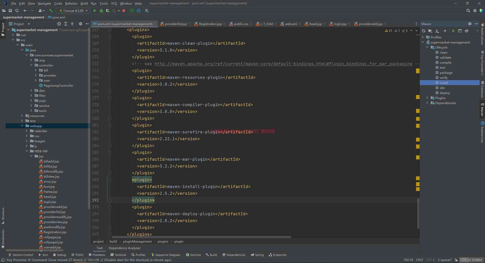
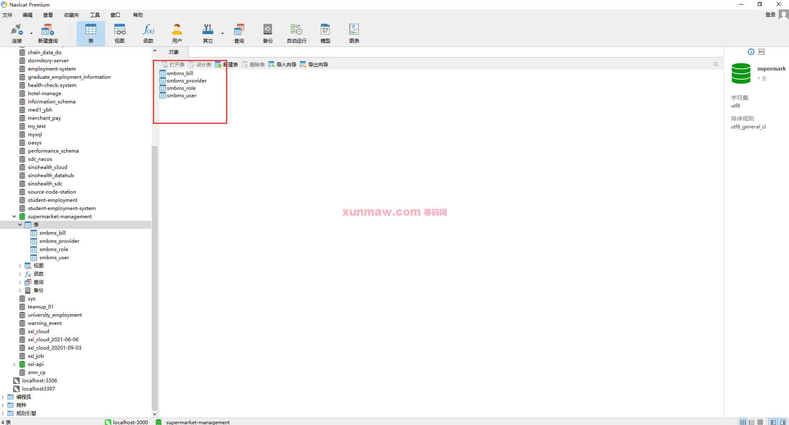
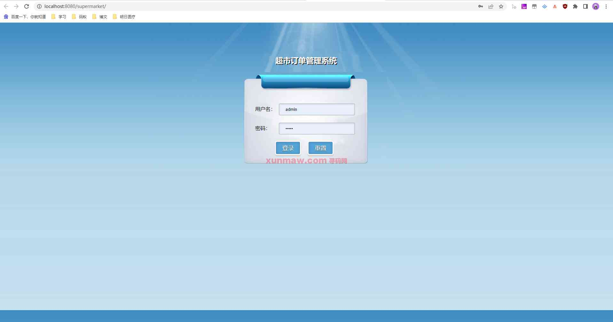
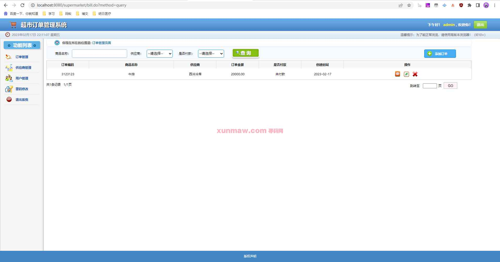
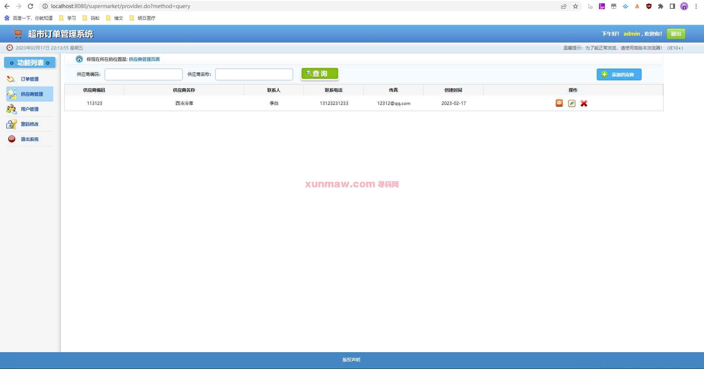
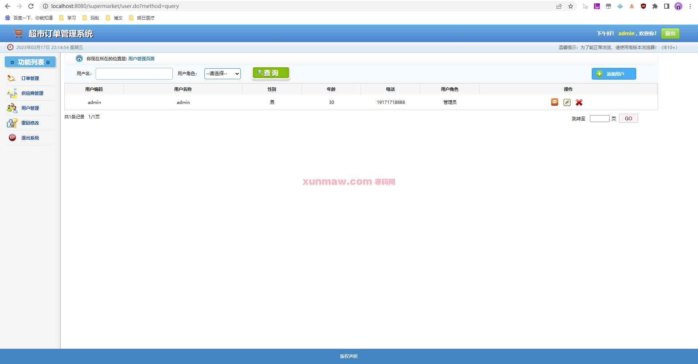
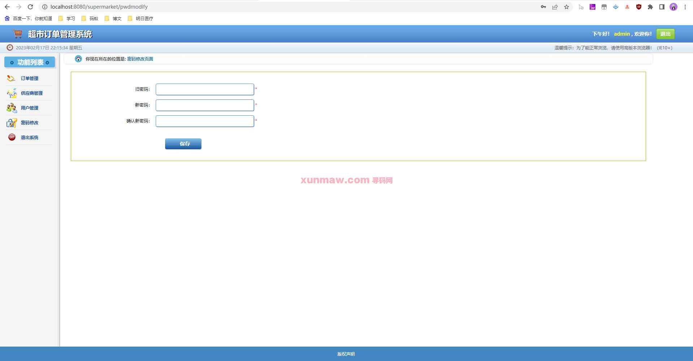

# 超市订单管理系统

#### 介绍
系统主要业务是对超市供应商以及订单进行管理与维护

#### 软件架构
后端技术：spring + springmvc + mybatis  
前端技术：jsp  
环境要求：jdk1.8 | maven | mysql  

#### 功能介绍
##### 【代码结构与数据库截图】
  
  

##### 【功能详述】 
△登录  
在登录页面，填写账号、密码、验证码，验证成功可成功登录页面。  

△订单管理  
超市购买订单信息管理，包含商品信息，价格、供应商信息。  

△供应商管理  
对超市供应商的基础信息进行管理，比如供应商名称、联系人、联系电话等等  

△用户管理  
对用户账号信息进行管理，包括用户的基本信息，用户对超市系统的登录等等，提供基础的增删改查  

△修改密码  
主要是针对当前用户的登录密码进行修改  

#### 项目预览
地址：[商品详情 ](https://www.xunmaw.com/shop/detail/1626954804098842625)   
点击商品详情中的演示地址，看查看系统录制的视频    

#### 使用说明
1. 创建数据库，执行数据库脚本
2. 修改jdbc数据库连接参数
3. 下载安装maven依赖jar
4. 在tomcat服务器部署项目  
    请求地址： http://localhost:8080/supermarket    
    用户名：admin  
    密码：admin  

#### 联系作者
获取源码 联系微信：xunmaw001
